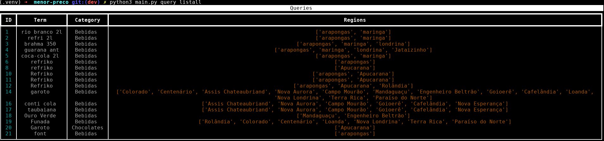
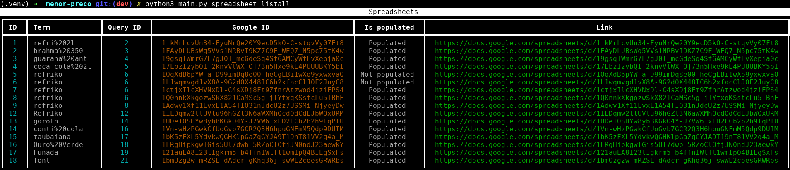

# Menor preco nota Paraná Scraper App

Este é um aplicativo de linha de comando (CLI) desenvolvido para facilitar o processo de scraping de dados do site **Menor preco nota Paraná**. O aplicativo permite criar, atualizar, deletar e listar consultas (queries) que são usadas para extrair informações específicas do site. Além disso, o app também oferece funcionalidades para criar e gerenciar planilhas no Google Sheets com os dados extraídos.

## Funcionalidades

### 1. **Gerenciamento de Consultas (Queries)**
   - **Criar uma nova consulta**: Permite criar uma nova query com um termo de busca, regiões e raio de busca. O app sugere categorias relacionadas ao termo e permite ao usuário escolher uma delas.
   - **Atualizar uma consulta existente**: Permite atualizar o termo de busca ou a categoria de uma query existente.
   - **Deletar uma consulta**: Remove uma query do banco de dados.
   - **Listar todas as consultas**: Exibe todas as queries armazenadas no banco de dados.

### 2. **Gerenciamento de Planilhas (Spreadsheets)**
   - **Criar uma nova planilha**: Cria uma nova planilha no Google Sheets associada a uma query específica. O app permite escolher uma query existente ou criar uma nova.
   - **Popular uma planilha**: Preenche a planilha com os dados extraídos do site Nota Paraná.
   - **Deletar uma planilha**: Remove uma planilha do banco de dados (não exclui a planilha do Google Sheets).
   - **Listar todas as planilhas**: Exibe todas as planilhas armazenadas no banco de dados.

## Requisitos

- Python 3.8 ou superior
- Bibliotecas Python:
  - `typer`
  - `rich`
  - `google-api-python-client`
  - `google-auth`
  - `requests`
  - `sqlalchemy` (ou outro ORM/banco de dados de sua escolha)

## Instalação

1. **Clone o repositório**:
   ```bash
   git clone https://github.com/seu-usuario/nota-parana-scraper.git
   cd nota-parana-scraper
   ```

2. **Crie um ambiente virtual** (opcional, mas recomendado):
   ```bash
   python -m venv venv
   source venv/bin/activate  # No Windows use `venv\Scripts\activate`
   ```

3. **Instale as dependências**:
   ```bash
   pip install -r requirements.txt
   ```

4. **Configure as credenciais do Google Sheets**:
   - Siga as instruções da [documentação oficial do Google Sheets API](https://developers.google.com/sheets/api/quickstart/python) para obter as credenciais necessárias.
   - Coloque o arquivo `credentials.json` na raiz do projeto.

5. **Configure o banco de dados**:
   - O app usa um banco de dados para armazenar as queries e planilhas. Configure o banco de dados de sua escolha e atualize as configurações no arquivo `database/__init__.py`.

## Uso

### Comandos Disponíveis

#### Gerenciamento de Consultas

- **Criar uma nova consulta**:
  ```bash
  python main.py create --term "termo de busca" --locals "região1" "região2" --radius 10.0
  ```

- **Atualizar uma consulta existente**:
  ```bash
  python main.py update --q 1 --t "novo termo" --c 2
  ```

- **Deletar uma consulta**:
  ```bash
  python main.py delete --q 1
  ```

- **Listar todas as consultas**:
  ```bash
  python main.py listall
  ```

#### Gerenciamento de Planilhas

- **Criar uma nova planilha**:
  ```bash
  python main.py create --q 1
  ```

- **Popular uma planilha**:
  ```bash
  python main.py populate --s 1
  ```

- **Deletar uma planilha**:
  ```bash
  python main.py delete --s 1
  ```

- **Listar todas as planilhas**:
  ```bash
  python main.py listall
  ```

## Exemplos de Uso

### Criando uma nova consulta e gerando uma planilha

1. **Crie uma nova consulta**:
   ```bash
   python main.py query create --term "restaurante" --locals "Curitiba" "Londrina" --radius 5.0
   ```

2. **Escolha uma categoria**:
   - O app exibirá uma lista de categorias sugeridas. Escolha uma digitando o número correspondente.

3. **Crie uma planilha**:
   ```bash
   python main.py spreadsheet create --q 1
   ```

4. **Popule a planilha com dados**:
   ```bash
   python main.py spreadsheet populate --s 1
   ```

### Listando todas as consultas e planilhas

- **Listar todas as consultas**:
  ```bash
  python main.py query listall
  ```



- **Listar todas as planilhas**:
  ```bash
  python main.py listall
  ```

  

## Contribuição

Contribuições são bem-vindas! Sinta-se à vontade para abrir issues ou pull requests para melhorar o projeto.

## Licença

Este projeto está licenciado sob a licença MIT. Veja o arquivo [LICENSE](LICENSE) para mais detalhes.

---

**Nota**: Este projeto é um exemplo e pode precisar de ajustes para funcionar em um ambiente de produção. Certifique-se de configurar corretamente as credenciais do Google Sheets e o banco de dados antes de usar.
